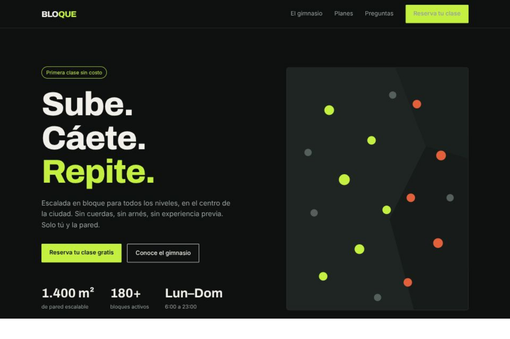

# 🧗 Bloque — Landing Page de Gimnasio de Escalada

Landing page responsiva para un gimnasio de escalada en bloque, con formulario de registro validado y navegación adaptable a móvil.

**Demo en vivo:** [pega aquí tu link de Vercel/Netlify]



## Funcionalidades

- Menú de navegación con hamburguesa funcional en móvil
- Sección de planes y precios
- Formulario de reserva con validación en tiempo real (nombre, correo, día preferido) y mensajes de error específicos por campo
- Confirmación visual al enviar el formulario correctamente
- Acordeón de preguntas frecuentes con `<details>` nativo de HTML
- Totalmente responsive: probado en móvil, tablet y escritorio

## Tecnologías

- HTML5 semántico
- CSS3 (Grid, Flexbox, variables CSS)
- JavaScript (ES6+) para el menú móvil, el acordeón y la validación del formulario

## Cómo correrlo localmente

Este proyecto no necesita instalación ni build. Solo:

1. Clona el repositorio
   ```bash
   git clone https://github.com/tu-usuario/landing-gimnasio.git
   ```
2. Abre el archivo `index.html` en tu navegador

## Qué aprendí construyendo esto

- A maquetar una página completa de varias secciones combinando CSS Grid (para layouts de dos columnas) y Flexbox (para alineaciones internas)
- A construir un menú responsive funcional desde cero, sin librerías
- A validar formularios en el cliente de forma accesible: mostrando el error junto al campo correspondiente y moviendo el foco al primer campo inválido
- Uso de elementos HTML nativos como `<details>`/`<summary>` para evitar JavaScript innecesario en el acordeón

## Posibles mejoras futuras

- Conectar el formulario a un servicio real de envío (Formspree, backend propio)
- Agregar animaciones de scroll más elaboradas
- Internacionalización (versión en inglés)

---

Proyecto creado como parte de mi portafolio de desarrollo frontend. [Ver portafolio completo](https://github.com/Nsaavedra0523)
